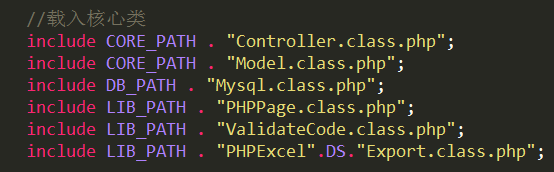
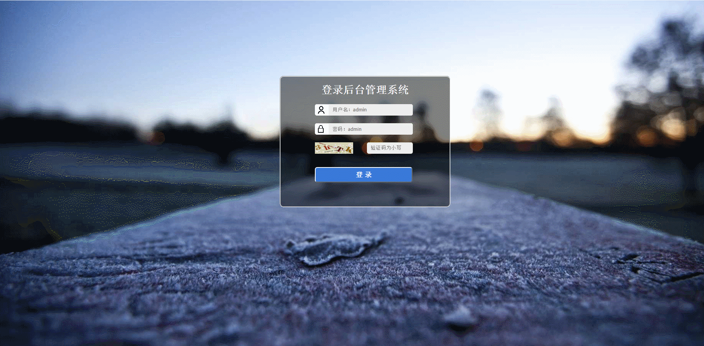
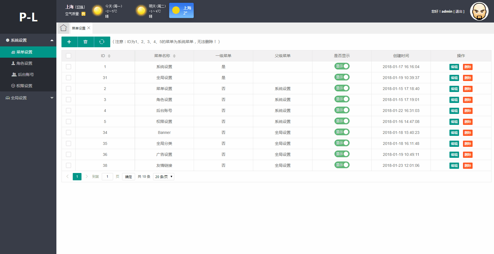

# LP-ADMIN
------
## 1.目录结构
```
lpAdmin
└───application
|        └─── config
|               └─── config.php ----------------------数据库配置
|        └─── controllers ----------------------------控制器 
|               └─── admin ---------------------------后台 
|               └─── home  ---------------------------前台 
|        └─── models ---------------------------------模型  
|        └─── views ----------------------------------视图 
|               └─── admin ---------------------------后台 
|               └─── home  ---------------------------前台 
└───framework
│        └─── core
|               └─── Controller.class.php -----------控制器基类
|               └─── Framework.class.php  -----------框架核心类 
|               └─── Model.class.php ----------------模型基类 
│        └─── database 
|               └─── Mysql.class.php ----------------数据库CURD函数库
│        └─── libraries -----------------------------扩展库（目前有数据库导出Excel、分页、验证码） 
│   
└───public ------------------------------------------公共文件  
│        └─── font  ---------------------------------字体文件  
│        └─── images --------------------------------图片  
│        └─── js    ---------------------------------js
│        └─── style ---------------------------------样式
│        └─── uploads  ------------------------------上传文件
└─── ueditor ----------------------------------------ueditor富文本编辑器上传文件  
│   
└───favicon.ico -------------------------------------网站头图标
└───index.php   -------------------------------------入口文件
```
* 本框架是引用smarty模板引擎的单层MVC框架，开发前需注意以下几点：
> * 需要修改/framework/core/Framework.class.php中的常量'BASE_SITE'（主机名），如："http://www.baidu.com/", <font color=#B00000 >注意：</font>最后的“/”不能省略，为方便编写可按需定义路径常量。
> * 根据不同需求，若要添加扩展，需将扩展核心类，在Framework.class.php中引用。

## 2.后台模块
### 1.登录页 
##### 纯手撸，未使用任何框架模板，做的不好看勿喷

### 2.菜单设置

